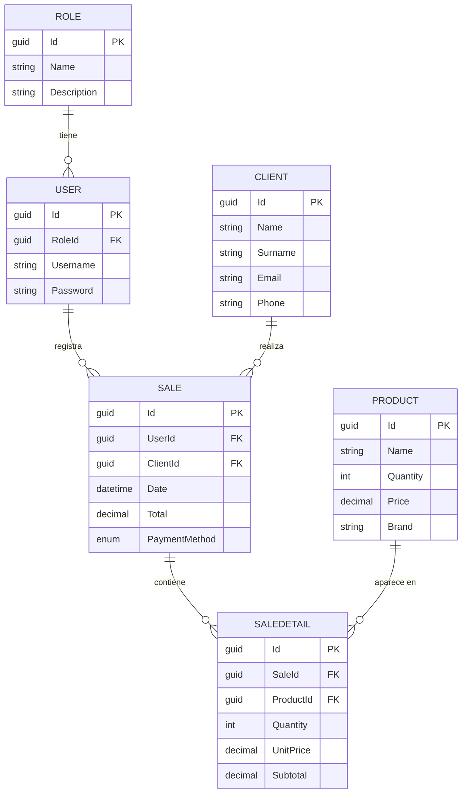

<!--
  Badge pendiente: se activa solo cuando exista el archivo LICENSE.
  Basta con descomentarlo y moverlo al bloque de abajo.

  [](LICENSE)
-->

<div align="center">

# Store API

**API REST de gestión de ventas construida con ASP.NET Core 10, EF Core y PostgreSQL.**

[](https://github.com/Mirandaaca/sample-api-rest-dotnet-10/actions/workflows/ci.yml)
[](https://dotnet.microsoft.com/)
[](https://learn.microsoft.com/ef/core/)
[](https://www.postgresql.org/)
[](#roadmap)
[](https://github.com/Mirandaaca/sample-api-rest-dotnet-10/stargazers)
[](https://github.com/Mirandaaca/sample-api-rest-dotnet-10/commits/main)

</div>

---

## Sobre el proyecto

API REST para la gestión de una tienda: clientes, productos, usuarios y ventas con su respectivo detalle. Está construida siguiendo una **arquitectura en capas** (Controller → Service → Repository) con separación explícita mediante interfaces e inyección de dependencias.

El objetivo del proyecto es doble:

1. **Construir una API REST bien estructurada** con las prácticas actuales de ASP.NET Core 10 y Entity Framework Core.
2. **Montar un pipeline de CI/CD completo** sobre un servidor Fedora autoalojado: al publicar un tag, Jenkins compila el proyecto, aplica migraciones y actualiza el servicio `systemd` en producción sin intervención manual.

> [!NOTE]
> Proyecto en desarrollo activo. Actualmente los módulos de **clientes** y **productos** exponen endpoints; el resto de entidades están modeladas y migradas, pero aún sin su capa de servicios. Ver el [roadmap](#roadmap).

---

## Arquitectura

Cada capa depende únicamente de la abstracción de la siguiente, lo que permite sustituir implementaciones y testear en aislamiento.

```
HTTP Request
     │
     ▼
┌─────────────────┐   Recibe la petición, valida el binding
│   Controller    │   y delega. No conoce EF Core.
└────────┬────────┘
         │ IClientService
         ▼
┌─────────────────┐   Lógica de negocio y mapeo
│    Service      │   Entity ⇄ DTO. Lanza excepciones
└────────┬────────┘   de dominio.
         │ IClientRepository
         ▼
┌─────────────────┐   Acceso a datos. Único punto
│   Repository    │   que toca el DbContext.
└────────┬────────┘
         │ StoreContext
         ▼
┌─────────────────┐
│   PostgreSQL    │
└─────────────────┘
```

**Decisiones de diseño**

| Elemento | Motivo |
|---|---|
| DTOs separados de las entidades | Evita exponer el modelo de dominio y las propiedades de navegación en la API. `ClientDTO` (escritura) y `ReadClientDTO` (lectura) permiten que el `Id` sea de solo lectura. |
| Excepciones de dominio | Cada excepción hereda de `DomainException` y declara su propio `StatusCode` y `Title`, de modo que `DomainExceptionHandler` traduce cualquiera de ellas sin conocer los tipos concretos. |
| `AsNoTracking()` en lecturas | Las consultas de solo lectura no necesitan el change tracker de EF Core. |
| `Guid` como clave primaria | Permite generar identificadores en cliente y evita colisiones al integrar orígenes de datos distintos. |

---

## Modelo de datos



Métodos de pago disponibles (`PaymentMethodEnum`): `Cash`, `CreditCard`, `DebitCard`, `QRCode`, `BankTransfer`.

---

## Stack

| Componente | Tecnología |
|---|---|
| Framework | ASP.NET Core 10.0 (Web API) |
| ORM | Entity Framework Core 10.0 |
| Base de datos | PostgreSQL (proveedor `Npgsql`) |
| Validación | [FluentValidation](https://docs.fluentvalidation.net/) 12 |
| Errores | `ProblemDetails` (RFC 9457) vía `IExceptionHandler` |
| Documentación | OpenAPI + [Scalar](https://scalar.com/) |
| Lenguaje | C# 14 · `Nullable` e `ImplicitUsings` habilitados |

---

## Requisitos previos

- [.NET SDK 10.0](https://dotnet.microsoft.com/download/dotnet/10.0) o superior
- Una instancia de **PostgreSQL** accesible (local, Docker o un servicio gestionado como [Render](https://render.com/) o [Neon](https://neon.tech/))
- La herramienta `dotnet-ef` para gestionar migraciones:

  ```bash
  dotnet tool install --global dotnet-ef
  ```

Verifica la instalación con:

```bash
dotnet --version    # debe reportar 10.x
dotnet ef --version
```

<details>
<summary><b>Levantar PostgreSQL con Docker (opcional)</b></summary>

```bash
docker run --name store-db \
  -e POSTGRES_USER=store_user \
  -e POSTGRES_PASSWORD=store_password \
  -e POSTGRES_DB=storedb \
  -p 5432:5432 \
  -d postgres:16
```

</details>

---

## Instalación

**1. Clonar el repositorio**

```bash
git clone https://github.com/Mirandaaca/sample-api-rest-dotnet-10.git
cd sample-api-rest-dotnet-10
```

**2. Configurar la cadena de conexión**

El archivo `appsettings.json` está excluido del control de versiones porque contiene credenciales. Créalo en `CIWithJenkins/appsettings.json` con el siguiente contenido:

```json
{
  "Logging": {
    "LogLevel": {
      "Default": "Information",
      "Microsoft.AspNetCore": "Warning"
    }
  },
  "ConnectionStrings": {
    "DefaultConnection": "Host=localhost;Port=5432;Database=storedb;User ID=store_user;Password=store_password;"
  },
  "AllowedHosts": "*"
}
```

> [!WARNING]
> No commitees este archivo. Para entornos reales, prefiere variables de entorno:
> ```bash
> export ConnectionStrings__DefaultConnection="Host=...;Database=...;User ID=...;Password=..."
> ```
> ASP.NET Core las resuelve con mayor prioridad que `appsettings.json` sin necesidad de cambiar el código.

**3. Restaurar dependencias y aplicar migraciones**

```bash
dotnet restore
dotnet ef database update --project CIWithJenkins
```

**4. Ejecutar**

```bash
dotnet run --project CIWithJenkins
```

La API queda disponible en:

| Perfil | URL |
|---|---|
| HTTP | `http://localhost:5026` |
| HTTPS | `https://localhost:7291` |

---

## Documentación interactiva

En entorno de desarrollo, la referencia de la API se genera automáticamente y se sirve con Scalar:

| Recurso | URL |
|---|---|
| Interfaz Scalar | `http://localhost:5026/scalar/v1` |
| Documento OpenAPI | `http://localhost:5026/openapi/v1.json` |

Ambos endpoints solo se registran cuando `ASPNETCORE_ENVIRONMENT=Development`.

---

## Endpoints

### Clientes — `/api/Client`

| Método | Ruta | Descripción | Cuerpo | Respuesta |
|---|---|---|---|---|
| `GET` | `/api/Client` | Lista todos los clientes | — | `200` · `ReadClientDTO[]` |
| `GET` | `/api/Client/{id}` | Obtiene un cliente por su `Guid` | — | `200` · `ReadClientDTO` |
| `POST` | `/api/Client` | Crea un cliente | `ClientDTO` | `201` |
| `PUT` | `/api/Client/{id}` | Actualiza un cliente existente | `ClientDTO` | `204` |
| `DELETE` | `/api/Client/{id}` | Elimina un cliente | — | `204` |

### Productos — `/api/Product`

| Método | Ruta | Descripción | Cuerpo | Respuesta |
|---|---|---|---|---|
| `GET` | `/api/Product` | Lista todos los productos | — | `200` · `ReadProductDTO[]` |
| `GET` | `/api/Product/{id}` | Obtiene un producto por su `Guid` | — | `200` · `ReadProductDTO` |
| `POST` | `/api/Product` | Crea un producto | `ProductDTO` | `201` |
| `PUT` | `/api/Product/{id}` | Actualiza un producto existente | `ProductDTO` | `204` |
| `DELETE` | `/api/Product/{id}` | Elimina un producto | — | `204` |

**Esquemas**

```jsonc
// ClientDTO — entrada para POST y PUT
{
  "name": "Cristopher",
  "surname": "Miranda",
  "email": "cristopher@example.com",
  "phone": "70000000"
}

// ReadClientDTO — salida (añade el Id generado)
{
  "id": "3fa85f64-5717-4562-b3fc-2c963f66afa6",
  "name": "Cristopher",
  "surname": "Miranda",
  "email": "cristopher@example.com",
  "phone": "70000000"
}

// ProductDTO — entrada para POST y PUT
{
  "name": "Teclado mecánico",
  "quantity": 25,
  "price": 349.90,
  "brand": "Keychron"
}

// ReadProductDTO — salida (añade el Id generado)
{
  "id": "9c1f2a30-4b8e-4d21-9f6a-1e7c5b2d8a04",
  "name": "Teclado mecánico",
  "quantity": 25,
  "price": 349.90,
  "brand": "Keychron"
}
```

**Ejemplo**

```bash
curl -X POST http://localhost:5026/api/Client \
  -H "Content-Type: application/json" \
  -d '{"name":"Cristopher","surname":"Miranda","email":"cristopher@example.com","phone":"70000000"}'
```

---

## Manejo de errores

Todos los errores se devuelven como `application/problem+json` siguiendo el estándar **RFC 9457 (ProblemDetails)**, con un `traceId` que permite correlacionar la respuesta con la entrada del log.

| Situación | Estado | Origen |
|---|---|---|
| Datos de entrada inválidos | `400` | `FluentValidation` → `ValidationProblemDetails` |
| Recurso inexistente | `404` | `ClientNotFoundException`, `ProductNotFoundException` |
| Fallo no previsto | `500` | Se registra completo en el log; hacia afuera solo el `traceId` |

```jsonc
// GET /api/Client/3fa85f64-5717-4562-b3fc-2c963f66afa6
{
  "type": "https://tools.ietf.org/html/rfc9110#section-15.5.5",
  "title": "Resource not found",
  "status": 404,
  "detail": "A client with Id '3fa85f64-5717-4562-b3fc-2c963f66afa6' was not found.",
  "instance": "GET /api/Client/3fa85f64-5717-4562-b3fc-2c963f66afa6",
  "traceId": "00-73d18169243c629ad8feb8c6d3dc67dd-d4c6362a159c1003-00"
}

// POST /api/Product con cantidad negativa y precio en cero
{
  "type": "https://tools.ietf.org/html/rfc9110#section-15.5.1",
  "title": "One or more validation errors",
  "status": 400,
  "instance": "POST /api/Product",
  "errors": {
    "Brand": ["Brand is required."],
    "Quantity": ["The quantity cannot be negative."],
    "Price": ["The price must be greater than zero."]
  }
}
```

Cada excepción de dominio hereda de `DomainException` y declara su propio `StatusCode` y `Title`. Por eso `DomainExceptionHandler` no conoce ninguna excepción concreta: agregar un módulo nuevo no requiere modificarlo.

---

## Estructura del proyecto

```
CIWithJenkins/
├── Context/            StoreContext — configuración del DbContext y DbSets
├── Controllers/        Endpoints HTTP
├── DTOs/               Objetos de transferencia por módulo
├── Entities/           Modelo de dominio mapeado por EF Core
├── Enums/              Enumeraciones del dominio
├── Exceptions/         Excepciones de dominio, con su código HTTP asociado
├── Handlers/           DomainExceptionHandler — traducción de excepción a ProblemDetails
├── Interfaces/
│   ├── Repository/     Contratos de acceso a datos
│   └── Services/       Contratos de lógica de negocio
├── Migrations/         Migraciones generadas por EF Core
├── Repository/         Implementaciones de acceso a datos
├── Services/           Implementaciones de lógica de negocio
├── Validators/         Reglas de validación de entrada (FluentValidation)
└── Program.cs          Composición de la aplicación y registro de dependencias
```

Al añadir un módulo nuevo se replica el mismo corte vertical: entidad → DTOs → interfaz de repositorio → repositorio → interfaz de servicio → servicio → controlador, registrando las dos últimas dependencias en `Program.cs`.

---

## Roadmap

**API**

- [x] Modelo de datos y migraciones iniciales
- [x] CRUD de clientes con arquitectura en capas
- [x] CRUD de productos
- [x] Manejo global de excepciones (traducción de excepciones de dominio a `ProblemDetails`)
- [x] Validación de entrada con FluentValidation
- [ ] CRUD de usuarios y roles
- [ ] Registro de ventas con su detalle y cálculo de totales
- [ ] Autenticación y autorización con JWT
- [ ] Paginación y filtrado en los listados
- [ ] Patrón Unit of Work para operaciones transaccionales
- [ ] Endpoint de health check (`/health`)

**Calidad**

- [ ] Pruebas unitarias de la capa de servicios (xUnit + Moq)
- [ ] Pruebas de integración con Testcontainers

**Infraestructura**

- [x] Workflow de CI en GitHub Actions (build + tests en cada push a `main`)
- [ ] `Jenkinsfile` de despliegue disparado por tags `v*`
- [ ] Despliegue automatizado a servicio `systemd` sobre Fedora con estrategia de releases y rollback
- [ ] Aplicación de migraciones en el despliegue mediante EF Core migration bundles

---

## Autor

**Cristopher Miranda** — [@Mirandaaca](https://github.com/Mirandaaca)
